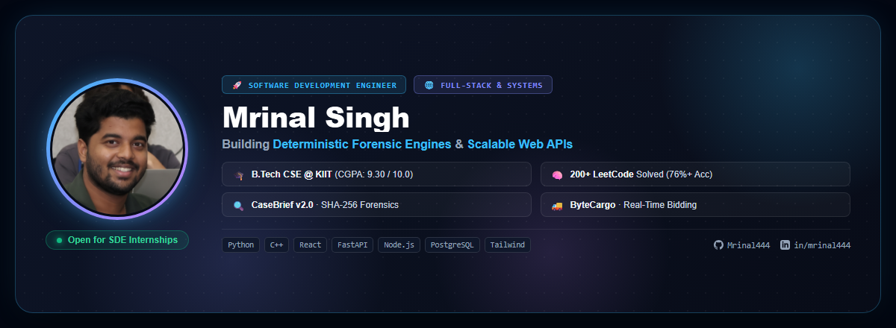

<div align="center">

  <p align="center">
    
  </p>

  <h1>Hi 👋, I'm <a href="https://github.com/Mrinal444">Mrinal Singh</a></h1>
  
  <p align="center">
    <a href="https://git.io/typing-svg">
      
    </a>
  </p>

  <p align="center">
    <a href="https://komarev.com/ghpvc/?username=mrinal444&label=Profile%20Views&color=0e75b6&style=flat-square"></a>
    <a href="https://github.com/Mrinal444"></a>
  </p>

  <p align="center">
    <a href="https://linkedin.com/in/mrinal444" target="_blank"></a>
    <a href="https://leetcode.com/u/s_mrinal" target="_blank"></a>
    <a href="mailto:mrings98@gmail.com"></a>
    <a href="https://github.com/Mrinal444" target="_blank"></a>
  </p>

  

</div>

---

### 👨‍💻 Quick Snapshot

```yaml
Name: Mrinal Singh
Title: Software Development Engineer (SDE) | Full-Stack & Applied Systems
Location: Bhubaneswar, Odisha, India
College: KIIT Bhubaneswar (B.Tech in Computer Science & Engineering, 2024 - 2028)
Academics: CGPA: 9.30 / 10.00
Core Focus: Scalable Web Architectures, Cyber Forensics, Deterministic Parsing & ML APIs
```

- 🎓 **B.Tech CSE Undergrad @ KIIT**: Deep focus on **Data Structures, Algorithms, DBMS, OOP, and Operating Systems**.
- 🚀 **Open Source Contributor**: Interned with **GirlScript Summer of Code (GSSoC '25)** and active contributor during **Hacktoberfest**.
- 🧠 **Algorithmic Problem Solver**: Solved **200+ problems on LeetCode** with a **76%+ acceptance rate** ([@s_mrinal](https://leetcode.com/u/s_mrinal)).
- 🏆 **Hackathons**: Institutional Finalist for **Smart India Hackathon (SIH26135)**.
- ⚡ **What I'm building**: Deterministic evidence reconstruction engines, logistics bidding platforms, and high-performance REST microservices.

---

### 🛠️ Languages & Tech Stack

<p align="center">
  <b>💻 Programming Languages</b><br/>
  
  
  
  
  
  
  
</p>

<p align="center">
  <b>🌐 Frontend & Backend Frameworks</b><br/>
  
  
  
  
  
  
  
  
</p>

<p align="center">
  <b>🗄️ Databases & Cloud Deployment</b><br/>
  
  
  
  
</p>

<p align="center">
  <b>🤖 Applied Machine Learning & Data</b><br/>
  
  
  
</p>

<p align="center">
  <b>⚙️ Developer Tools & Systems</b><br/>
  
  
  
  
  
</p>

---

### 🚀 Featured Engineering Projects

<table>
  <tr>
    <td width="50%" valign="top">
      <h3 align="center">🔍 CaseBrief v2.0</h3>
      <p align="center">
        <b>Cyber Forensics & Fraud Evidence Reconstruction Platform</b>
      </p>
      <p align="center">
        <a href="https://github.com/Mrinal444/casebrief"></a>
      </p>
      <ul>
        <li><b>Zero-Hallucination Parser</b>: Ingests multi-modal forensic evidence (WhatsApp exports, SMS, phishing URLs, bank statements, DNS traces) into unified chronological audit timelines.</li>
        <li><b>SHA-256 Chain-of-Custody</b>: Deterministic cryptographic hashing ensuring court-admissible digital integrity and tamper-proofing.</li>
        <li><b>Performance</b>: Automated cross-evidence entity extraction and anomaly checks, reducing forensic triage time by <b>~70%</b>.</li>
      </ul>
      <p><b>Tech:</b> <code>Python</code> <code>SHA-256</code> <code>Rule Engines</code> <code>Regex/NLP</code> <code>JSON Pipelines</code></p>
    </td>
    <td width="50%" valign="top">
      <h3 align="center">🚚 ByteCargo</h3>
      <p align="center">
        <b>Full-Stack Logistics & Real-Time Bidding Marketplace</b>
      </p>
      <p align="center">
        <a href="https://bytecargo-one.vercel.app"></a>
        <a href="https://github.com/Mrinal444/bytecargo"></a>
      </p>
      <ul>
        <li><b>Auction Marketplace</b>: Connects merchants with verified transporters for real-time shipment bidding, quote negotiation, and ETA status tracking.</li>
        <li><b>Security & RBAC</b>: Protected REST APIs with JWT authentication, role-based merchant/transporter access control, and normalized PostgreSQL schemas.</li>
        <li><b>Cloud Native</b>: Modular frontend with responsive Tailwind UI, deployed on <b>Vercel</b> & <b>Render</b>.</li>
      </ul>
      <p><b>Tech:</b> <code>React.js</code> <code>Node.js</code> <code>Express.js</code> <code>PostgreSQL</code> <code>TailwindCSS</code> <code>JWT</code></p>
    </td>
  </tr>
  <tr>
    <td colspan="2" valign="top">
      <h3 align="center">📊 SkillOutcome — Smart India Hackathon (SIH PS135)</h3>
      <p align="center">
        <b>Predictive Career Engine & Placement Probability REST API</b>
      </p>
      <p align="center">
        <a href="https://github.com/Mrinal444/skilloutcome"></a>
      </p>
      <ul>
        <li><b>ETL Pipelines</b>: Processed comprehensive multi-factor student profiles across <b>13 normalized relational tables</b> with chronological validation splits.</li>
        <li><b>ML Inference Engine</b>: Implemented calibrated predictive models to forecast placement probability, attrition risk, and role-based skill-gap roadmaps.</li>
        <li><b>Sub-100ms API</b>: Deployed high-throughput <b>FastAPI</b> endpoints delivering low-latency inference for university administrative dashboards.</li>
      </ul>
      <p><b>Tech:</b> <code>Python</code> <code>FastAPI</code> <code>Scikit-learn</code> <code>Feature Engineering</code> <code>PostgreSQL</code></p>
    </td>
  </tr>
</table>

---

### 📈 Activity & Analytics

<div align="center">
  
  <br/><br/>
  <table border="0">
    <tr>
      <td valign="top" width="50%">
        
      </td>
      <td valign="top" width="50%">
        
      </td>
    </tr>
    <tr>
      <td valign="top" width="50%">
        
      </td>
      <td valign="top" width="50%">
        
      </td>
    </tr>
  </table>
</div>

---

### 🤝 Connect With Me

<div align="center">

  <p>I'm always excited to collaborate on open-source initiatives, discuss distributed backend systems, or explore SDE opportunities!</p>

  <a href="https://linkedin.com/in/mrinal444" target="_blank">
    
  </a>
  <a href="mailto:mrings98@gmail.com">
    
  </a>
  <a href="https://github.com/Mrinal444" target="_blank">
    
  </a>

  <br/><br/>
  
  

  <p><i>Crafted with passion for clean code, system design, and scalability 🚀</i></p>

</div>
